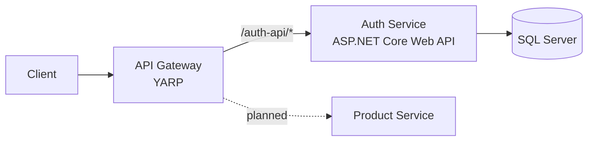

# YK.Backend

Microservice backend built with **.NET 10**, featuring a YARP API Gateway and a JWT-based Auth service following **Clean Architecture** and **CQRS**. A Product service is in progress.


## Architecture



The gateway routes `/auth-api/*` to the Auth service, strips the prefix, and forwards `X-Forwarded-*` headers. Local orchestration runs through **.NET Aspire**.

### Auth service layers

```
ServiceApplications/Auth
├── Core
│   ├── YK.Auth.Domain           # Entities, enums
│   └── YK.Auth.Application      # Use cases (MediatR), validators, abstractions
├── Infrastructure
│   └── YK.Auth.Infrastructure   # EF Core, ASP.NET Identity, token service, migrations, seeding
└── Presentation
    └── YK.Auth.WebAPI           # Controllers, middleware, auth config, OpenAPI
```

## Features

- **JWT authentication** with configurable signing: HS256 or RS256
- **Refresh tokens** with rotation and SHA-256 hashed storage (raw tokens are never persisted)
- **Single-session login**: each login revokes all previous refresh tokens for the user
- **Reuse detection**: replaying a rotated refresh token revokes every active session for that user
- **Race-safe rotation**: a conditional update ensures concurrent refresh requests with the same token produce only one new session
- **Lockout-aware refresh**: locked-out users cannot refresh, and their sessions are revoked
- **Role-based authorization** (Admin, Seller, Buyer); self-registration limited to Buyer and Seller
- **CQRS with MediatR** and a **FluentValidation** pipeline behavior
- **Centralized exception handling** returning RFC 7807 `ProblemDetails`, including JWT 401/403
- **Automatic migrations and seeding** on startup, with retry while the database wakes up
- **Observability** via Aspire ServiceDefaults (OpenTelemetry, health checks)
- **CI/CD** to Azure App Service with GitHub Actions using OIDC (no stored credentials)

## Tech stack

| Area | Technology |
|---|---|
| Framework | .NET 10, ASP.NET Core Web API |
| Gateway | YARP Reverse Proxy |
| Data | EF Core, SQL Server |
| Identity | ASP.NET Core Identity, JWT Bearer |
| Patterns | Clean Architecture, CQRS, MediatR, FluentValidation |
| Orchestration | .NET Aspire |
| Docs | OpenAPI, Swagger UI |
| DevOps | GitHub Actions, Azure App Service |

## Getting started

### Prerequisites

- .NET 10 SDK
- SQL Server (LocalDB or SQL Express)

### 1. Clone

```bash
git clone https://github.com/sumon1607112/yk-backend.git
cd yk-backend
```

### 2. Configure secrets

Keys are not stored in the repository. Set them with user secrets:

```bash
cd ServiceApplications/Auth/Presentation/YK.Auth.WebAPI
dotnet user-secrets init

# HS256
dotnet user-secrets set "Jwt:SigningAlgorithm" "HS256"
dotnet user-secrets set "Jwt:Hs256:SecretKey" "<at-least-32-character-random-string>"

# Optional: first admin account
dotnet user-secrets set "Seed:Admin:Phone" "<phone>"
dotnet user-secrets set "Seed:Admin:Password" "<password>"
```

For RS256, set `Jwt:SigningAlgorithm` to `RS256` and provide `Jwt:Rs256:PrivateKey` and `Jwt:Rs256:PublicKey` in PEM format.

Update `ConnectionStrings:DefaultConnection` in `appsettings.json` if you're not using `localhost\SQLEXPRESS`. When hosted, the `DATABASE_URL` environment variable takes precedence.

### 3. Run

**With Aspire** (gateway + auth together):

```bash
dotnet run --project Aspire/YK/YK.AppHost
```

**Or individually:**

```bash
dotnet run --project ServiceApplications/Auth/Presentation/YK.Auth.WebAPI   # http://localhost:50001
dotnet run --project APIGateway/YK.APIGateway                              # http://localhost:50000
```

Migrations are applied automatically on startup.

Swagger UI: `http://localhost:50000/swagger` (via gateway) or `http://localhost:50001/swagger` (direct).

## API

All routes below are shown through the gateway (`/auth-api` prefix).

| Method | Endpoint | Auth | Description |
|---|---|---|---|
| POST | `/auth-api/api/Accounts/Register` | Public | Register a Buyer or Seller |
| POST | `/auth-api/api/Accounts/Login` | Public | Get access and refresh tokens |
| POST | `/auth-api/api/Accounts/Refresh` | Public | Rotate refresh token |
| POST | `/auth-api/api/Accounts/Logout` | Public | Revoke a refresh token (idempotent) |
| POST | `/auth-api/api/Roles/Create` | Admin | Create a role |

> **Accounts are scoped by phone and role.** The same phone number can hold separate Buyer and Seller accounts, so login takes phone, role, and password.

### Register

```json
{
  "registerRequest": {
    "createUserRequest": {
      "phone": "01700000000",
      "email": "user@example.com",
      "password": "Passw0rd!",
      "role": "Buyer"
    }
  }
}
```

### Login

```json
{
  "loginRequest": {
    "phone": "01700000000",
    "role": "Buyer",
    "password": "Passw0rd!"
  }
}
```

Response:

```json
{
  "tokens": {
    "accessToken": "eyJhbGciOi...",
    "refreshToken": "q1w2e3r4..."
  }
}
```

### Refresh

```json
{
  "refreshTokenRequest": {
    "refreshToken": "q1w2e3r4..."
  }
}
```

Returns a new access token and a new refresh token. The old refresh token is revoked.

### Logout

```json
{
  "logoutRequest": {
    "refreshToken": "q1w2e3r4..."
  }
}
```

Returns `204 No Content`, including when the token is already revoked or unknown.

### Errors

Errors are returned as `ProblemDetails`:

```json
{
  "status": 401,
  "title": "Unauthorized",
  "detail": "Invalid phone, role, or password."
}
```

## Token lifecycle

| Event | Effect |
|---|---|
| Login | Issues a new token pair and revokes all existing refresh tokens for the user |
| Refresh | Revokes the presented token, links it to its replacement, and issues a new pair |
| Refresh with a rotated token | Treated as theft: all active sessions for the user are revoked |
| Refresh with a token revoked by login/logout | Rejected with 401 |
| Refresh by a locked-out user | Rejected and all sessions revoked |
| Logout | Revokes the presented refresh token |

Access tokens are short-lived (15 minutes by default) and stateless.

## Deployment

Each service has its own GitHub Actions workflow in `.github/workflows/`. A push to `main` builds and deploys only the service whose files changed. Authentication to Azure uses OIDC federated credentials with a user-assigned managed identity.

## Roadmap

- [x] Logout endpoint
- [ ] Unit and integration tests
- [ ] Rate limiting and lockout on failed logins
- [ ] Admin lock/unlock and "log out all devices"
- [ ] Product service
- [ ] Docker Compose setup

## Author

**Md Yasin Sumon** · [Portfolio](https://sumon1607112.github.io) · [GitHub](https://github.com/sumon1607112)